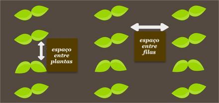

# Desafio programação - vaga desenvolvedor Ruby on Rails

O objetivo deste teste é avaliar seus conhecimentos técnicos e domínio em Ruby on Rails, por isso deve ser feito por você. Você tem uma semana para entregar, se precisar de mais tempo entre em contato para nos informar. Leia as instruções com atenção!

## Descrição do projeto

O desafio consiste na criação de uma aplicação que contenha três entidades:
 - Contatos comerciais, que podem ser clientes ou fornecedores contendo os atributos:
    - Nome
    - tipo - cliente | fornecedor
    - Email - com validação de formato e unicidade no modelo
 - Propriedades produtivas, com os atributos:
    - Nome
    - Área
    - Espécie de planta
    - N° de plantas
    - Espaçamento entre fileiras 
      - Unidade de medida: centímetro ou metro.
    - Espaçamento entre plantas
      - Unidade de medida: centímetro ou metro.
 - Especie de planta
    - Nome

### Informações: 
As entidades devem se relacionar da seguinte forma: Caso o contato comercial seja um fornecedor, pode ter até 3 propriedades. Clientes não tem nenhuma.
Ao excluir um fornecedor as propriedades pertencentes a ele devem ser excluídas tambem.
Uma propriedade pode ter N espécies de plantas e uma espécie de planta pode estar em N propriedades.      
O número de plantas deve ser calculado automaticamente utilizando o espaçamento entre fileiras e plantas com a fórmula: <b>nº de plantas = Área / (Espaçamento entre fileiras * Espaçamento entre plantas)</b>. Dica: converter a área para metro quadrado e também passar os espaçamentos para metros no o cálculo

A aplicação deve ter pelo menos as seguintes telas:
- Uma tela principal de listagem dos contatos comerciais, a partir da qual se pode excluir contatos, acessar os detalhes de cada contato, e acesso a tela de criação de novo contato. A lista deve exibir o nome dos contatos e ser ordenada pelo primeiro nome.
- Uma tela de novo registro, contendo um formulário simples de criação de contatos.
- Uma tela de detalhes de contato. Essa tela deve conter, CASO SEJA UM FORNECEDOR, uma seção de propriedades, contendo a lista das propriedades (é uma lista breve, pois terá no máximo 3) que pertencem ao contato e uma interação para adicionar novas propriedades. Na lista deve ser possível editar os atributos da propriedade ou excluí-la.

**Algumas observações:**

Quanto aos estilos, preocupe-se com o conteúdo, a estilização pode ser apenas o mínimo necessário para organizar as informações de uma forma clara e compreensível.

Essas são as funcionalidades básicas que sua aplicação deve conter, sinta-se à vontade para adicionar recursos, se achar que faz sentido.

**Requisitos:**

- A aplicação deve ser escrita em Ruby 2.0+ e Rails 5+
- Deve utilizar apenas linguagens e bibliotecas livres ou gratuitas
- Os commits devem ser descritivos
- Utilize banco MySQL
- Aplique testes unitários com RSPEC
- Readme descrevendo o projeto e seu setup

## Instruções de entrega do desafio

1. Ao finalizar seu projeto crie um repositório no github
 - Se for privado dê acesso a @matheuscschenfeld
2. Envie via email o link do projeto para seu contato na Elysios com o título "[Rails dev] + seu nome"
3. Adicione ao readme uma breve descrição do que você fez e o passo a passo para subir a aplicação. Se você fizer o deploy são pontos extras! Caso o faça disponibilize também o link na descrição.

# Avaliação

1. A aplicação deve conter as funcionalidades descritas e respeitar/atender as tecnologias requeridas;
2. Qualidade do seu código e estrutura do projeto;
3. As instruções de entrega devem ser seguidas conforme descrito bem como a apresentação do projeto no arquivo readme;
4. Qualidade e cobertura dos testes unitários.

---

Boa sorte!
